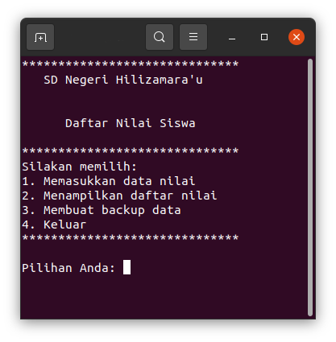

# data_sekolah

Aplikasi sekolah berbasis database sebagai bahan latihan belajar python.

Saat ini baru daftar nilai yang ada, tapi dengan gampang Anda dapat membuat fungsi lainnya dengan menggunakan metode yang sama mis. membuat daftar siswa, daftar guru, daftar buku dslb.

Ada menu pilihan:
1. Memasukkan daftar nilai yang baru
2. Menampilkan daftar nilai yang telah ada
3. Membuat backup (ke server seandainya ada)
4. Keluar




## Bagaimana mulai

Klon repositori ini ke komputer Anda lalu jalankan aplikasi dengan perintah
```
python3 data_sekolah.py
```


## Catatan

Database utama sekolah ada dalam berkas `data_sekolah.json`. Daftar nilai terdapat dalam key "nilai".

Pada saat proses backup, data dari daftar sementara akan disimpan ke dalam database.

Ya'ahowu.

